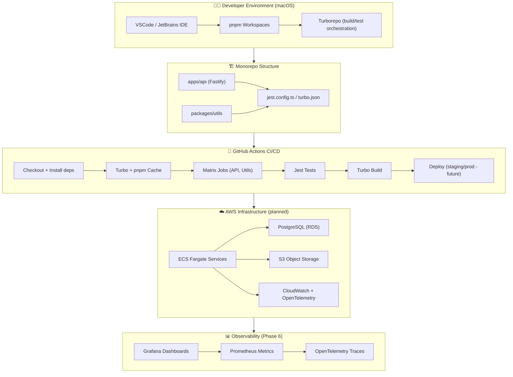

# 🧭 System Architecture – Fresh Recipes

This diagram shows how the **Fresh Recipes** platform fits together:  
from monorepo to CI/CD, then out to AWS infrastructure (planned in future phases).

## 🧱 Architecture Layers

| **Layer** | **Primary Components** | **Key Responsibilities** | **Example Technologies** |
|:-----------|:-----------------------|:--------------------------|:--------------------------|
| **Developer Environment** | Local tools (VS Code, pnpm, Turbo) | Rapid local dev and test, one-command bootstrap | macOS Terminal, pnpm v9, Turborepo v2 |
| **Monorepo Structure** | `apps/` (services), `packages/` (libs) | Code organisation, dependency sharing, consistent lint/test/build pipelines | TypeScript 5, Fastify, Jest, Prettier |
| **Continuous Integration / Delivery (CI/CD)** | GitHub Actions, Turbo caching | Automated build/test per workspace, matrix parallelism, deploy gates | GitHub Actions, Turbo CLI, pnpm cache |
| **Cloud Infrastructure (Phase 05)** | AWS ECS Fargate, RDS (PostgreSQL), S3, SSM Secrets | Container orchestration, persistent storage, environment isolation | Terraform + AWS Provider |
| **Observability & Ops (Phase 06)** | Pino logs, OpenTelemetry, Prometheus, Grafana | Centralised logging, metrics, tracing, SLO dashboards | OTEL SDK, Prometheus Operator, Grafana Cloud |
| **Developer Experience & Automation (Phase 07)** | Prettier, ESLint, Husky, Commitlint | Consistent code style, local checks, automated pre-commit validation | Node tools, Husky hooks |
| **Security & Compliance (Phase 09)** | IAM roles, Secrets Manager, dependency scanners | Least-privilege access, supply-chain integrity, compliance checks | AWS IAM, Dependabot, Trivy |
| **Performance & Cost Optimisation (Phase 10)** | Load testing, caching layers, autoscaling policies | Maintain performance under load while optimising AWS spend | k6, AWS Auto Scaling, CloudWatch Metrics |
| **Productisation & Docs (Phase 11)** | Swagger UI, Confluence/Markdown docs | API documentation, onboarding, changelogs | @fastify/swagger, MkDocs, GitHub Pages |

Next planned diagram updates:
	•	Add service-to-service messaging (SNS/SQS or NATS)
	•	Add Terraform modules (Phase 5)
	•	Add network topology (VPC, ALB, private subnets) in Phase 6
