# 🧭 System Architecture – Fresh Recipes

This diagram shows how the **Fresh Recipes** platform fits together:  
from monorepo to CI/CD, then out to AWS infrastructure (planned in future phases).

```mermaid
flowchart TD
    subgraph Dev["👩‍💻 Developer Environment (macOS)"]
        IDE["VSCode / JetBrains IDE"]
        PNPM["pnpm Workspaces"]
        Turbo["Turborepo (build/test orchestration)"]
        IDE --> PNPM --> Turbo
    end

    subgraph Repo["🏗️ Monorepo Structure"]
        API["apps/api (Fastify)"]
        Utils["packages/utils"]
        Shared["jest.config.ts / turbo.json"]
        API --> Shared
        Utils --> Shared
    end

    Dev --> Repo

    subgraph CI["🔁 GitHub Actions CI/CD"]
        Checkout["Checkout + Install deps"]
        Cache["Turbo + pnpm Cache"]
        Matrix["Matrix Jobs (API, Utils)"]
        Jest["Jest Tests"]
        Build["Turbo Build"]
        Deploy["Deploy (staging/prod - future)"]
        Checkout --> Cache --> Matrix --> Jest --> Build --> Deploy
    end

    Repo --> CI

    subgraph Cloud["☁️ AWS Infrastructure (planned)"]
        ECS["ECS Fargate Services"]
        PG["PostgreSQL (RDS)"]
        S3["S3 Object Storage"]
        Logs["CloudWatch + OpenTelemetry"]
        ECS --> PG
        ECS --> S3
        ECS --> Logs
    end

    CI --> Cloud

    subgraph Obs["📊 Observability (Phase 6)"]
        Grafana["Grafana Dashboards"]
        Prometheus["Prometheus Metrics"]
        OTEL["OpenTelemetry Traces"]
        Grafana --> Prometheus
        Prometheus --> OTEL
    end

    Cloud --> Obs
```

🗺️ Architecture Layers

